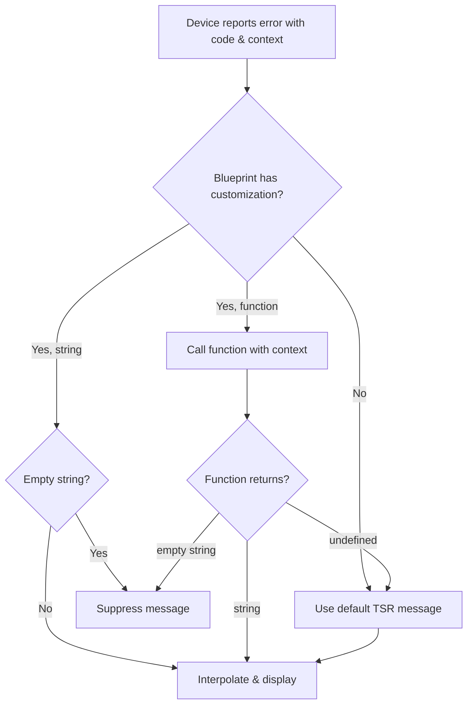

# Error Message Customization

Blueprints can customize the error messages displayed to users in the Sofie UI. This allows you to replace technical error messages with human-friendly ones that are relevant to your broadcast environment.

## Overview

Sofie displays error notifications from several sources:

- **Device errors** - from TSR devices (ATEM, CasparCG, vMix, etc.) - customized via **Studio Blueprint**
- **Package errors** - from the Package Manager (media files, thumbnails) - customized via **ShowStyle Blueprint**
- **System errors** - from Sofie Core itself - customized via **System Blueprint**

Each error type is customized in a different blueprint type, matching where the errors originate.

## Device Error Messages (Studio Blueprint)

Device errors come from TSR (Timeline State Resolver) integrations. Customize them in your **Studio Blueprint**:

```typescript
import { StudioBlueprintManifest } from '@sofie-automation/blueprints-integration'
import { AtemErrorCode, CasparCGErrorCode } from 'timeline-state-resolver-types'

export const manifest: StudioBlueprintManifest = {
  // ... other manifest properties ...

  deviceErrorMessages: {
    // Simple string template with placeholders
    [AtemErrorCode.DISCONNECTED]: 'Vision mixer offline - check network to {{host}}',
    
    // Use {{deviceName}} for the configured device name
    [CasparCGErrorCode.DISCONNECTED]: '{{deviceName}}: Graphics server offline ({{host}}:{{port}})',
    
    // Empty string suppresses the error entirely
    [AtemErrorCode.SOME_NOISY_WARNING]: '',
  },
}
```

### Using Placeholders

Error messages support `{{placeholder}}` syntax for dynamic values. Common placeholders include:

- `{{deviceName}}` - The configured name of the device in Sofie
- `{{deviceId}}` - The internal device ID
- Additional context from the specific error (e.g., `{{host}}`, `{{port}}`, `{{channel}}`)

### Function-Based Messages

For complex logic, use a function instead of a string. Functions can return:
- A **string** - Use this as the custom message
- **`undefined`** - Fall back to the default TSR message
- **`''`** (empty string) - Suppress the message entirely

```typescript
import { DeviceErrorContext } from '@sofie-automation/blueprints-integration'

deviceErrorMessages: {
  [CasparCGErrorCode.CHANNEL_ERROR]: (context: DeviceErrorContext) => {
    const channel = context.channel as number
    if (channel === 1) return 'Primary graphics output failed!'
    if (channel === 2) return 'Secondary graphics output failed!'
    return `Graphics channel ${channel} error on ${context.deviceName}`
  },
  
  // Return undefined to use the default TSR message
  [SomeErrorCode.COMPLEX_ERROR]: (context) => {
    if (context.isExpected) return undefined // Fall back to default
    return `Unexpected error on ${context.deviceName}`
  },
  
  // Return empty string to suppress
  [SomeErrorCode.NOISY_WARNING]: (context) => {
    if (context.severity === 'low') return '' // Suppress low severity
    return `Warning on ${context.deviceName}`
  },
}
```

### Available Error Codes

Import error codes from `timeline-state-resolver-types` for type safety:

```typescript
import { 
  AtemErrorCode,
  CasparCGErrorCode,
  VmixErrorCode,
  OBSErrorCode,
  // ... other device error codes
} from 'timeline-state-resolver-types'
```

Each device type exports its own error codes. Check the TSR documentation or source code for the complete list.

## Package Status Messages (ShowStyle Blueprint)

Package Manager messages are customized in your **ShowStyle Blueprint**:

```typescript
import { ShowStyleBlueprintManifest, PackageStatusMessage } from '@sofie-automation/blueprints-integration'

export const manifest: ShowStyleBlueprintManifest = {
  // ... other manifest properties ...

  packageStatusMessages: {
    [PackageStatusMessage.MISSING_FILE_PATH]: 'Media file path not configured - check ingest settings',
    [PackageStatusMessage.SCAN_FAILED]: 'Could not scan media file - check file permissions',
    [PackageStatusMessage.FILE_NOT_FOUND]: '', // Suppress this message
  },
}
```

## System Error Messages (System Blueprint)

System-level errors from Sofie Core are customized in your **System Blueprint**:

```typescript
import { SystemBlueprintManifest, SystemErrorCode } from '@sofie-automation/blueprints-integration'

export const manifest: SystemBlueprintManifest = {
  // ... other manifest properties ...

  systemErrorMessages: {
    [SystemErrorCode.DATABASE_CONNECTION_LOST]: 'Database offline - contact IT support',
    [SystemErrorCode.SERVICE_UNAVAILABLE]: 'Service {{serviceName}} is not responding',
  },
}
```

## Message Resolution

When an error occurs, Sofie resolves the message as follows:

1. **Check blueprint customization** - Look for matching error code in the appropriate blueprint
2. **If function** - Call it with the error context:
   - Returns `undefined` → Use default TSR message
   - Returns `''` (empty string) → Suppress the message
   - Returns a string → Use that as the message
3. **If string** - Interpolate placeholders with context values
4. **If empty string `''`** - Suppress the message entirely
5. **If not found** - Use the default message from TSR/Sofie

Device error resolution happens **server-side** when the error is received, ensuring consistent messages across all connected clients.



## Complete Example

Here's a complete Studio Blueprint example:

```typescript
import {
  StudioBlueprintManifest,
  DeviceErrorContext,
} from '@sofie-automation/blueprints-integration'
import { AtemErrorCode, CasparCGErrorCode } from 'timeline-state-resolver-types'

export const deviceErrorMessages: StudioBlueprintManifest['deviceErrorMessages'] = {
  // Simple string with placeholders
  [AtemErrorCode.DISCONNECTED]: '🎬 Vision mixer offline - check ATEM at {{host}}',
  [AtemErrorCode.PSU_FAULT]: '⚠️ ATEM PSU {{psuNumber}} fault - check hardware',
  
  // Graphics server with host:port
  [CasparCGErrorCode.DISCONNECTED]: '{{deviceName}}: Graphics offline ({{host}}:{{port}})',
  
  // Function for complex logic
  [CasparCGErrorCode.CHANNEL_ERROR]: (context: DeviceErrorContext) => {
    const channel = context.channel as number
    const channelNames: Record<number, string> = {
      1: 'Program graphics',
      2: 'Preview graphics', 
      3: 'DSK graphics',
    }
    const name = channelNames[channel] || `Channel ${channel}`
    return `${name} failed on ${context.deviceName}`
  },
}

export const manifest: StudioBlueprintManifest = {
  blueprintType: 'studio',
  // ... other required properties ...
  deviceErrorMessages,
}
```

## Tips

- **Keep messages actionable** - Tell users what to do, not just what's wrong
- **Use emoji sparingly** - They can help draw attention to critical errors
- **Test with real devices** - Disconnect devices to verify your messages appear correctly
- **Check TSR source** - Device error codes and their context values are defined in TSR integrations
- **Use functions for complex cases** - Conditional logic, pluralization, severity-based filtering

## See Also

- [TSR Device Integrations](https://github.com/nrkno/sofie-timeline-state-resolver) - Device error codes
- [Demo Blueprints](https://github.com/nrkno/sofie-demo-blueprints) - Working examples
